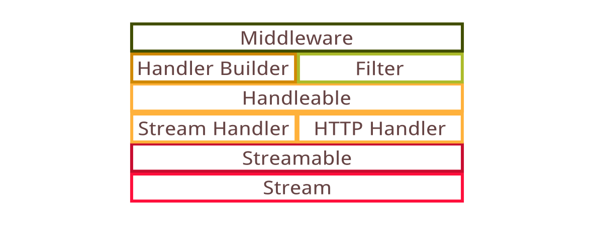
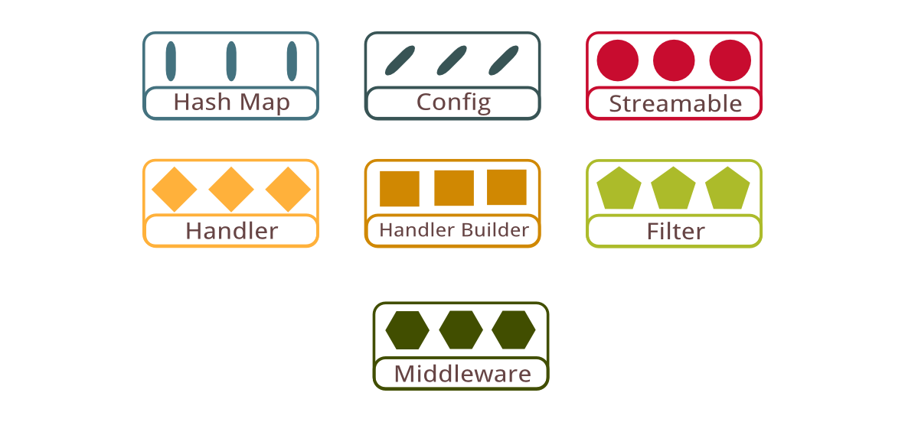

# Overview



When developing Quiver the most difficult challenge was to breaking down problems into smaller parts and solving each of them at a different layers. Many of the problems are interconnected, and therefore it is tempting to create one big solution that can solve all problems together. By splitting the architecture into several layers, the whole solution become radically simplified to just a collection of seemingly trivial function signatures.

The Quiver architecture is consist of six fundamental layers building on top of one another. This chapter will present each of the layers in detail and show how they are relate to each others. We will first discuss about the design of quiver stream and how it differs from conventional stream implementations. The streamable construct will then be introduced as an opaque stream supertype that is convertible between stream and other JavaScript objects. Following that various design of stream processing function signatures is discussed, and the stream handler construct is introduced.

We will also talk about http handler construct which is made different from the simpler stream handler. The handleable construct will then be introduced as a handler supertype for both stream and http handler. The issue of dependency management is then discussed next, and the handler builder construct will be instroduced as the constructor function for handlers.

Finally the techniques of handler extensions is discussed with the introduction of filter, which accept a handler and extend it through composition. Middleware is the last construct to be introduced, with the power of extending existing handler builders.



## Illustration Guide

Different object types are illustrated in different colors and shapes to make it easy to identify the relationship. At the basic level, an object is shown as a rectangle box containing text label and three identical colored shapes. The different shapes used are mainly to aid viewing of this literature printed on black-and-white paper.

The number of identical shapes in a component figure do not carry significant meaning. Instead the difference in number is used to differentiate multiple objects of the same type but with different content.


As an example, the figure above illustrates the interface of a stream handler object, shown as orange box with diamond shape. The arrows indicate that the stream handler is a function that accepts an args object and a streamable object, and asynchronously return a new streamable object. Notice that the two streamable objects have different number of circle shapes inside them, indicating that the streamable returned by stream handler may be different from the streamable that it received.

## API Convention

A pseudocode coding convention is designed to make it easy to describe APIs available in Quiver. Following is a specification for an example API function:

```javascript
  api asyncFunction = function(args, callback(err, result));
```

The keyword `api` is used to indicate that the given code is an API specification. The `function` keyword following the equal sign `=` indicates that the API is a JavaScript function of the given signature. As Quiver runs on Node which is asynchronous in nature, its API functions also typically expects a callback function passed as the last argument. This is specified with the `callback` keyword followed by bracket containing arguments that the callback function expects. Following the Node convention, a callback function typically expects an error object `err` as its first argument, followed by the result.

```javascript
  api plainObject = { fieldName, [optionalField], ... }

  api syncFunction = function(args) -> result;
```

There are also some API for objects and synchronous functions. The example code above shows the API interface for a plain object, with a compulsory field `fieldName` and an optional field `optionalField`. The object may also have other optional fields, as indicated by the `...` at the end. The next example is a synchronous function API, which the result returned by the function is indicated after the arrow sign `->`.

It is usually self-explanatory of argument types in a function parameter, as they can usually be deduced based on the argument name.

## Next: [Stream](02-stream.md)