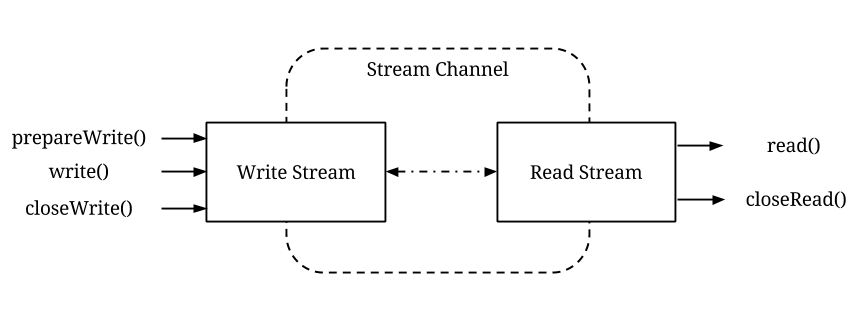
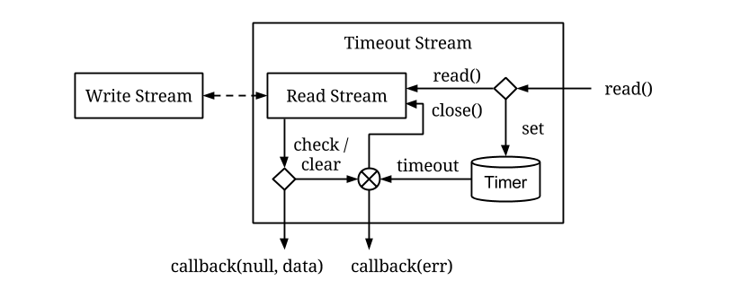
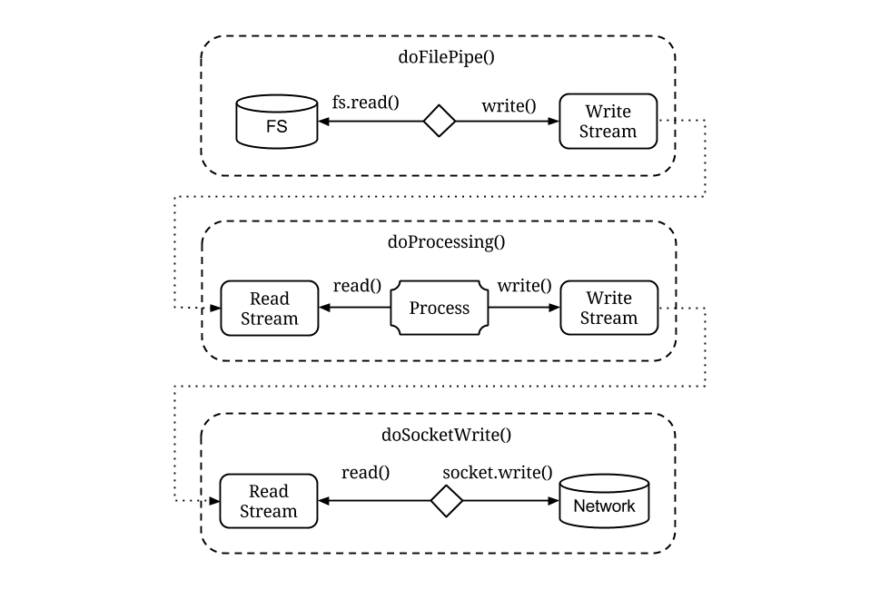
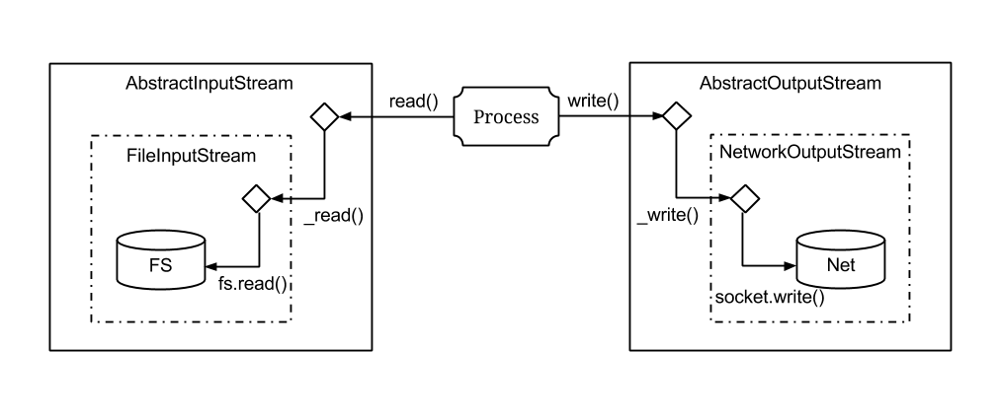

# Stream



Stream is the most basic building block in Quiver which allows the transfer of data streams. The stream architecture in Quiver follows a simple producer-consumer pattern in which a one producer writes data into the stream channel to be read by a single consumer on the other side.

A quiver stream is created as a pair of write stream and read stream as distinct objects. The linkage between the write stream and read stream is encapsulated. By making use of the scope constraints in JavaScript, it is made not possible to obtain the write stream counterpart from a read stream and vice versa.

Reading and writing to quiver streams is also asynchronous. When a reader calls the `read()` method on the read stream, the data is returned asynchronously to the provided callback only when the writer has written data to the write stream. Similarly by best practice writers may optionally call the `prepareWrite()` method of the write stream and get notified in the callback when reader on the other side is ready to read the data.

The design of quiver stream is very different from the stream implementation in many other libraries and frameworks. In most implementations the concrete streams are typically implemented as a single stream object which can be upcasted into either read stream or write stream depending on the function that accepts the stream object. Other than that there are typically many different stream implementations available based on the source or destination of the stream, i.e. file streams and network streams.



On the contrary, quiver streams are solely plain channels made for transferring data between two entities. Additional functionalities to the stream is built on top of it using functional composition. For example, instead of creating a stream implementation that supports read time out, the figure above shows a utility function is made to accept a read stream and return a new read stream that guarantees read callback after certain timeout.

As Quiver do not make use of object-oriented programming, there is no abstract class available for programmers to "extend" into different specialized streams. Instead, programmers create functions that read raw data from specific data source and then write them to a quiver write stream. The read stream counterpart is then returned to the user, making it appear as if the function creates a specialized stream.



The figure above shows the architecture of an example program that reads content from the file system, process the data and write it to the network. The data flow is split into three functions. The first function reads the content from the file system and writes it to a write stream. The second function reads the read stream that was connected to the previous write stream, process the data and then write the result to another write stream. Finally the third function reads the previously connected read stream and write the data to the network socket.

One of the benefits of quiver streams is the implicit rate control that limits the rate of functions producing data to write to the stream. Before programs can write data to a write stream, it may first call the `prepareWrite()` method of the write stream and get notified when reader on the other side is ready for reading.

In the example pipeline, the network is slow at writing the produced data to the socket. This would in turn slow down the rate of processing, which slow down the rate of reading from the file stream. This design also allow programmers to add a throttling component to the stream in ways similar to the stream timeout implementation.

## Conventional Stream



Contrary to the architecture in Quiver, the above figure shows the architecture of the same program implemented in conventional streams. Typically there is an abstract base class for the read/write (input/output) streams. Programmers then have to implement concrete stream classes that implement actual functionalities of how to read/write data from the stream. In the example we have a concrete FileInputStream class and NetworkOutputStream class implemented. In typical implementations the abstract stream class would have non-overridable `read/write` method, which will internally call some protected `_read/_write` method that is implemented by the concrete child classes. Finally a process function is used to read from the file input stream and write to the network output stream.

The two examples above show a vast distinction between the approach used for implementing streams. There are several problems in the conventional implementation of streams. The first problem is that it influence the programmer to think in terms of implementing a read/write method. It is also a passive approach as the code can only run when the user calls the method. The naming is also unnatural and confusing, as from the implementor's perspective he is really performing the opposite action. On the other hand Quiver allows programmers to implement the read/write actions happening in a natural way, making it easy to understand both sides of the code.

Another problem of the conventional stream pattern is that it is really hard to divide the processing into more than three components. Because there is no simple channels that redirect data written to another read stream, the processing code in the code have no choice but to implement all processing code as one monolithic function. Implementors of intermediary processing have to otherwise implement their code as a transform stream subclass of the original concrete class. Such approach gets complicated quickly and programmers quickly get lost in connecting the code through confusingly named inherited methods.

In conclusion, the minimalist approach to design quiver streams is what makes the implementation so powerful. The minimal interface specification of a quiver stream allows programmers to create wrapper around it to extend its functionality. It also requires minimal amount of code to create an alternative implementation of the stream that can be transparently replaced. The minimal functionality and implementation details also makes it easy to ensure the implementation is bug free, and extensibility through composition makes sure that new bugs can only be introduced at the higher layer of the code.

One could argue that there are some other features in conventional stream that otherwise can't be implemented in quiver streams. In the following sections I will show how these problems are solved by delegating them to higher level constructs.


## API Specification

```javascript
  api channel = { readStream, writeStream };
  
  api readStream = { read, closeRead };

  api writeStream = { write, prepareWrite, closeWrite };
```

Create a pair of connected read/write stream through the `quiver-stream-channel` library. The two end points are usually then passed to different functions that are responsible for the read or write operation. Content written into the write stream will be read from the read stream at the other end.

```javascript
  api readStream.read = function(callback(streamClosed, data));
```

Attempt to read data from a readStream, which the read result will be pass to readCallback asynchronously.

`streamClosed` is non-null if when the end of stream is reached. If error occured during read, the error value can be retrieved from `streamClosed.err`. Otherwise the data variable contain the read value, which is typically a single buffer object. `streamClosed` and data exist exclusively from each other, which mean if is streamClosed non-null then data is guaranteed to be null.

```javascript
  api readStream.closeRead = function(err);
```

Close the read stream optionally with an error value.

```javascript
  api writeStream.write = function(data);
```

Write data to a write stream immediately regardless of whether the reader on the other side is ready to read it. Calling this without prepareWrite gives the risk of having too much data buffered within the stream without reader reading it quick enough.

```javascript
  api writeStream.prepareWrite = function(callback(streamClosed));
```

Prepare to write to the write stream once the reader on the other side is ready, in which writeCallback will be called asynchronously. It is prohibited to call the write stream's `write()` method while `prepareWrite()` is waiting for its write callback. Such action do not have well defined semantics to the stream channel state and will cause an exception to be thrown.

Non-null streamClosed indicates that the stream has been prematurely closed and the writer should cancel all write operations. Otherwise it is now optimal for the writer to call `writeStream.write()`.
 
```javascript
  api writeStream.closeWrite = function(err);
```

Close the write stream with an optional error value.

## Next: [Streamable](03-streamable.md)