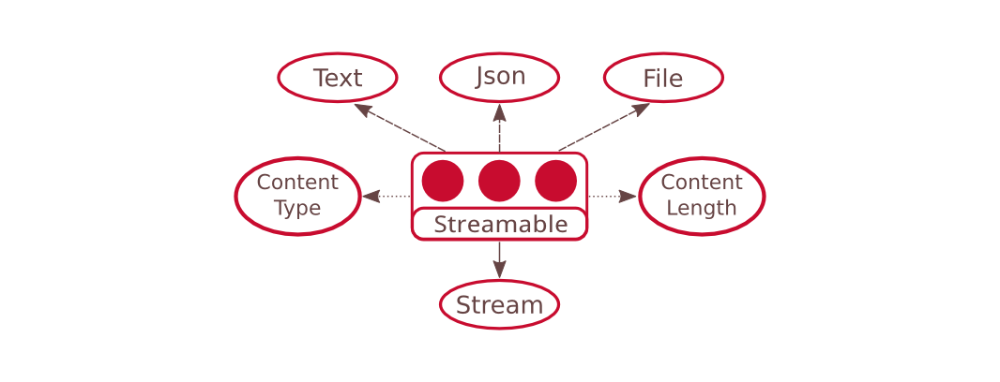
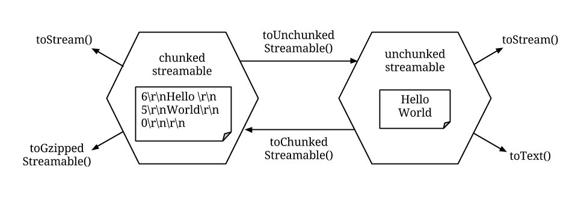

# Streamable

One of the problems of passing streams around as function arguments is that the stream typically have to be as a whole parsed into data structures that the function body can understand. On the other hand when a function produces data that it wish to write to the stream, the result data is typically held in a data structure that is later serialized into raw bytes.

Since parsing and serializing data takes a non-trivial amount of computation, what we want is to associate a data structure with a stream so that the two can be retrieved interchangibly depending on the format required. Moreover, there are usually more than two ways to represent a piece of data.

Take Json for example, a json data is a stream of Unicode characters written in a specific format. That same data can be represented as a plain JavaScript object, a JavaScript string, or a stream of raw bytes. When passing a Json data object around, it has to be possible to convert between these different formats.

In Quiver instead of directly passing stream objects around, the problem is solved by wrapping the stream inside another object called _streamable_. A streamable is a plain JavaScript object that is at least convertible into a read stream through a compulsory `toStream()` method. Other than that, data structures that are equivalent to the stream content are retrievable with methods of format `toXXXX()`, where `XXXX` is the type of data structure.



The figure above shows an example of a json streamable object, containing the basic `toStream()`, `toJson()`, and `toText()`[^toText] methods. On top of that the streamable has a `toFile()` method returning a file path, indicating that the streamable was constructed from a json file on local filesystem. Other than that the example streamable object also carry the optional `contentType` and `contentLength` attributes, which are metadata about the stream which can be useful for tasks such as constructing HTTP headers.

[^toText]: The reserved method name `toString()` have a different usage in JavaScript therefore the method `toText()` is used for converting streamable to string.

Streamable is designed as a plain JavaScript object, meaning that it do not contain any implementation detail of the data structures it represent. The `toXXXX()` methods perform one-way conversion return independent data structures that have no connection back to the original streamable object. 

```javascript
  streamConvert.streamableToJson = function(streamable, callback) {
    if(streamable.toJson) return streamable.toJson(callback)

    streamableToText(streamable, function(err, text) {
      if(err) return callback(err)

      var json = JSON.parse(text)

      streamable.toJson = function(callback) {
        callback(null, json)
      }

      callback(null, json)
    })
  }
```

Being plain old objects also allow external functions to easily add new formats to the streamable object by adding a new key to it. The above code demonstrates how the `quiver-stream-convert` library converts a streamable to json object. When first processing a streamable that contain only raw Json stream, the code can check whether the streamable object has a `toJson()` method which it can make use of. If not it will obtain the raw stream through `toStream()` and attempt to convert the stream into a single string. (which can optionally be done through `toText()`.) Once the string is obtained it is parsed using `JSON.parse()`. If the streamable is reusable, the resulting Json object is then stored to the original streamable by adding a new `toJson()` method that return a new copy of the Json object each time it is called.

The `toStream()` method on streamable also makes it possible to open a data stream multiple times for different readers. This is however on the condition that the streamable is reusable, as indicated by its `reusable` attribute. By default streamables are non-reusable because it would otherwise have to hold reference to the entire stream content until the streamable is garbage collected, which can cause memory performance issues. However when enabled, the reusable `toStream()` method makes streamable a convenient way to pass to functions that may have multiple readers. With this it also solves the problem of single ownership requirement of quiver streams by enabling multiple-ownership at a higher layer.

The design of streamable is contrary to conventional ways of implementing objects that represent multiple data structures. Conventionally such object is implemented through multiple inheritance or implementing multiple interfaces. The object would then have to either inherit the concrete methods or implement proxy methods to emulate the behavior of all formats it represent. This usually leads to complicated implementation that are prone to various problems such as naming conflict. Implementations inheriting from mutable data structures also have the problem of users mutating one of its representations and causing stale updates.

In conclusion, by having one-way conversion to independent data formats, streamable provides a flexible way to merge different data structures without conflicting implementations. The conversion methods also prevent stale updates by returning a copy of data structure that cannot be linked back regardless of mutation.


## API Reference

```javascript
  api streamable = { toStream, [toText], [toJson], ... };

  api streamable.toStream = function(callback(err, readStream));
```

Returns a quiver read stream representation of the data inside the streamable.

```javascript
  api streamable.toXXXXX = function(callback(err, result));
```

If a function with prefix “to” exist on the streamable, it can be used to convert the streamable object to the respective data form. Example of methods are `toText()` and `toJson()`.

## Streamable Enccoding Conversion

One requirement for streamable is that the data structure attached to it must have equivalent value with all other representation of the same stream, including the raw stream content. This creates an issue when trying to convert between encoded stream and raw stream.

There are many stream encoding that are designed to be transported efficiently over the network, for example compression, endianness, and the chunked transfer encoding. The stream content has to be decoded before converting the stream to their respective data structure.

It does not make sense to attach conversion functions to a streamable containing encoded stream, because the encoded stream is not directly equivalent to the respective data structure. On the other hand it is sometimes desirable to cache both the encoded and decoded content of the stream so that there is no need to re-encode/decode the content when transferring it over network.



The solution we have with this problem is shown in the figure above. It shows two streamables that are convertible between each others through the chunked transfer encoding/decoding. The chunk encoded streamable has a `toStream()` method that returns the encoded stream content. On the other hand only the decoded streamable has a `toText()` method that converts the decoded stream content into string.

This design of coupled streamables not only cleanly separate the semantics between encoded and decoded objects. It also allow stacking of multiple encodings to form through a connected chain of streamables. By navigating through the chains one can convert between all data formats and encodings without facing any ambiguity in their actions.

## Streamable Best Practice

Stream is the primary interface for different quiver components to communicate. The simplest concept of stream communication is with a function that reads data from a read stream and write its result to a write stream.

```javascript
  api processStream1 = function(readStream, writeStream);
```

A naive signature for such a function is to accept a read stream and a write stream as its argument. However it is more difficult to to compose functions with side effects as compared to pure functions. Even though Quiver is not strictly purely functional, for most practical purposes read streams can be treated like a read-only array of data, making it as effective as immutable arguments.

```javascript
  api processStream2 = function(readStream, 
    callback(err, readStream));
```

A better approach of writing the same function is to create a function that accepts a read stream and asynchronously return a result read stream. The result stream can be created within the function by creating a pair of read/write stream and return the read stream part to the caller. The function would then have exclusive access to the write stream and be confident that the reader on the other side will receive the exact data it sent.

The asynchronous approach is also better at error handling through the first err argument in the callback. This is more clear than the first synchronous example, which the function has no way to refine the error scope other than closing the write stream immediately.

```javascript
  api processStream3 = function(streamable, 
    callback(err, streamable));
```

With the introduction of streamable, there is an even better approach to rewrite the same function to accept streamable in place of read stream in the argument and result. Through this simple indirection this function signature become capable of accepting any serializable data type without sacrificing performance penalty of unnecessary conversions.

## Next: [Stream Handler](04-stream-handler.md)