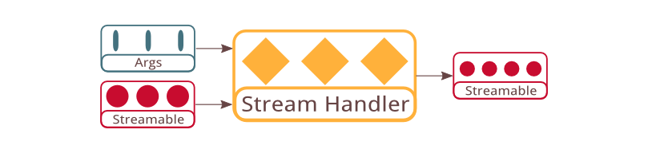

# Stream Handler



Quiver stream handler is designed following the Unix Philosophy. Unix process is well known for their extensibility through the uniform stream interfaces `STDIN`, `STDOUT`, and `STDERR`. Similarly stream handler is designed to have uniform interface across all kinds of programs to make them as easily composable as Unix processes. All quiver stream handler accept an `args` as their first argument, which is the equivalent of command line arguments. The second argument inputStreamable is a streamable object corresponds to STDIN. Finally the handler asynchronously returns either an error (STDERR) or a resultStreamable (STDOUT).

## API Specification

```javascript
  api streamHandler = function(args, inputStreamable, 
    callback(err, resultStreamable));
```

The `processStream3()` function signature arrived in the previous section is very close to the interface of a stream handler. Other than accepting and returning streamable, a stream handler also accepts an additional `args` argument which serve as key-value argument. The `args` argument allow stream handler functions to accept arbitrary number of keyword arguments while all have the same function signature.

## Stream Handler and HTTP

Stream handler works similarly with typical HTTP handlers, which accept a HTTP request and return a HTTP response. In a quiver web application some stream handlers are mapped to the front-facing HTTP server to process HTTP requests. But most of the time stream handlers are used internally by forming a graph of stream handlers that communicate with each others. More importantly, stream handler is designed to be protocol-neutral and can be adapted to use for protocols other than HTTP.

Stream handler is not obligated to understand standard HTTP headers such as transfer encoding, making it much simpler to implement and understand. The `args` argument is more often mapped to the query string parameters in HTTP request, but is also sometimes mapped to certain HTTP headers as long as it does not affect the interpretation of the input streamable content.

Other than that stream handler only return a result streamable which correspond to the HTTP response body, but there is no equivalance of HTTP response headers. Although the result streamable may contain optional meta data such as content type and content length, it is not allowed to carry information that affect the interpretation of the stream content such as transfer encoding and cookies.

On error the stream handler return an error object optionally containing HTTP error status code and a short error message to be written to the response body. By default undefined or invalid error code will cause the server to return status code 500 Internal Server Error.

Stream handler is designed to handle a subset of HTTP that follows Fielding's RESTful architecture design. With minimal protocol constraint, implementing stream handlers is almost as simple as writing plain JavaScript functions. When stream handlers are implemented to be pure from side effects, there are many functional programming techniques that can be applied to the stream handler to gain significant performance optimization from it.

## Next: [Http Handler](05-http-handler.md)