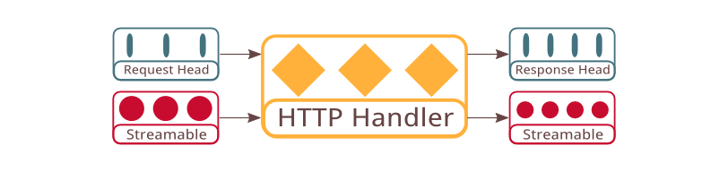

# HTTP Handler



Stream handler is designed to free users from the complexity of HTTP and allow handler functions to be composed more easily. While the `args` argument can loosely related to HTTP request header, in the handler callback there only exist the resultStreamable which loosely corresponds to HTTP response body but there is no correspondance of HTTP response header. The lack of response header equivalent is intentional as HTTP request and response headers alter the semantics of the input and result stream and therefore make it hard to understand.

Instead of using stream handler, Quiver has the HTTP handler construct used for handling full HTTP requests.

## API Specification

```javascript
  api httpHandler = function(requestHead, requestStreamable, 
    callback(err, responseHead, responseStreamable));
```

Unlike the original Node http handler, quiver http handler separates the HTTP header part from the HTTP body. It is designed such that it is easy for intermediaries to strip/add HTTP headers that alter the content of the body, such as Content-Encoding and Transfer-Encoding, and supply a different stream body independent of the original header.

The `requestHead` and `responseHead` format is compatible with the existing node API for the `request` object, minus the node stream and event API. They are also made of plain JavaScript objects and can be easily created using object literals.

## Next: [Handleable](06-handleable.md)