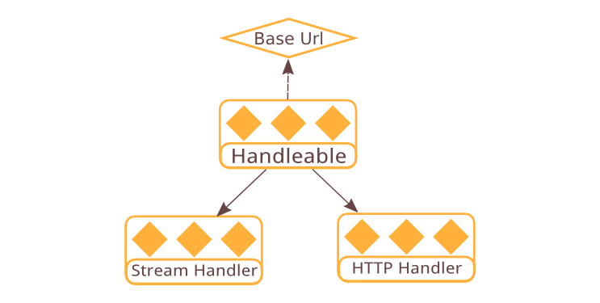

## Handleable



There are currently two types of handlers in Quiver: stream handler and http handler. Handler types are differentiated based on their function signature, and there is no class hierarchy or any common feature shared among handlers. There are times when one might want to create a handler that is usable as both stream and http handler, or write filters or middlewares that can be applied to both types of handlers. 

There is also common needs of attaching meta information to a handler, such as serializing it to URL or filesystem path. When composing handler components together using higher level constructs, it is also necessary to ensure the handler type of different components matches. To solve these problems Quiver make use of the same concept as streamable and create a handler supertype called _handleable_.

### API Specification

```javascript
  api handleable = { [toStreamHandler], [toHttpHandler], ... };

  api handleable.toStreamHandler = function() -> streamHandler;

  api handleable.toHttpHandler = function() -> httpHandler;
```

Like streamable, a handleable is a plain JavaScript object that has `toXXX()` methods to convert it to the right handler type. But unlike streamable, handleable convertion function return in synchronous style.

## Next: [Handler Builder](07-handler-builder.md)