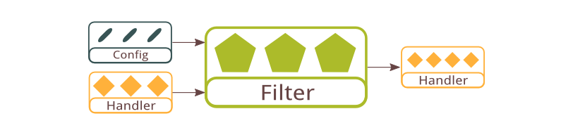
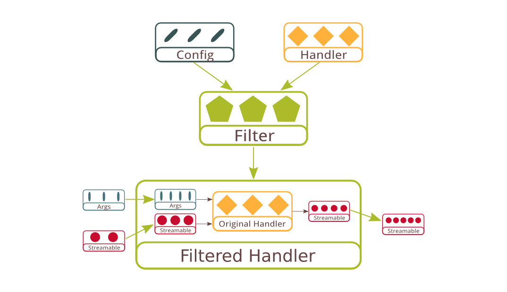

# Filter



Handlers and handler builders are just plain functions without class. Therefore it is not possible to extend a handler through classical inheritance. Instead, the _filter_ construct is introduced to allow flexible handler extension through functional composition.

## API Specification

```javascript
  api filter = function(config, handler, 
    callback(err, filteredHandler));
```

A filter have similar signature as handler builder, except that it has an additional parameter that accepts the original handler that it extends. Based on the supplied handler and the filter's configuration dependencies, the filter create an extended _filteredHandler_ closure to encapsulate the original handler.



The figure above shows a more detailed view inside of the filtered handler returned. The filter accepts its original handler as a black box but has full power to access all its input and output. In other words, it can make changes to `args` and `inputStreamable` before passing it to the original handler, and it can intercept `err` and `resultStreamable` produced by the original handler before returning to its caller. Moreover, a filter can decide to skip the original handler entirely and produce result on behalf of it.

Filter solves the problem of separation of concern by allowing developers to implement cross-cutting concerns as reusable filters. One can implement any of the `before()`, `after()`, or `around()` paradigms in Aspect Oriented programming all in one unified function interface.

## Example

One of the common use case for filter is to implement security concerns such as permission control. Below is an example of a stream filter that does permission checking based on a simple array of allowed users in the config.

```javascript
  var permissionFilter = function(config, handler, callback) {
    var allowedUsers = config.allowedUsers

    var filteredHandler = function(args, inputStreamable, callback) {
      if(allowedUsers.indexOf(args.user) == -1) return callback(
        error(403, 'Forbidden'))

      handler(args, inputStreamable, callback)
    }

    callback(null, filteredHandler)
  }
```

## HTTP Filter

Quiver http filter is simple but powerful construct that can be used to build the same intermediary chains exist in other powerful web servers such as Apache. The major difference is that HTTP filters are plain JavaScript functions that can easily be manipulated. Filters can also be easily enabled, disabled, or rearranged by simply manipulating the filter composition chain.

Nevertheless, it is recommended to write http filter only when the functionality is related to HTTP. Otherwise stream filter serve as much simpler alternative for implementing application-specific concerns.

## Handleable Filter

Similar to handler builder, the general term "filter" is refered for all handler types in general. Handleable filter is the supertype of all filters. Filters are converted to handleable filter by the quiver component system to make handler type checking possible. For example a stream filter is converted to a handleable filter that ensure the input handleable has a `toStreamHandler()` function before extending the handler.

## Next: [Middleware](09-middleware.md)