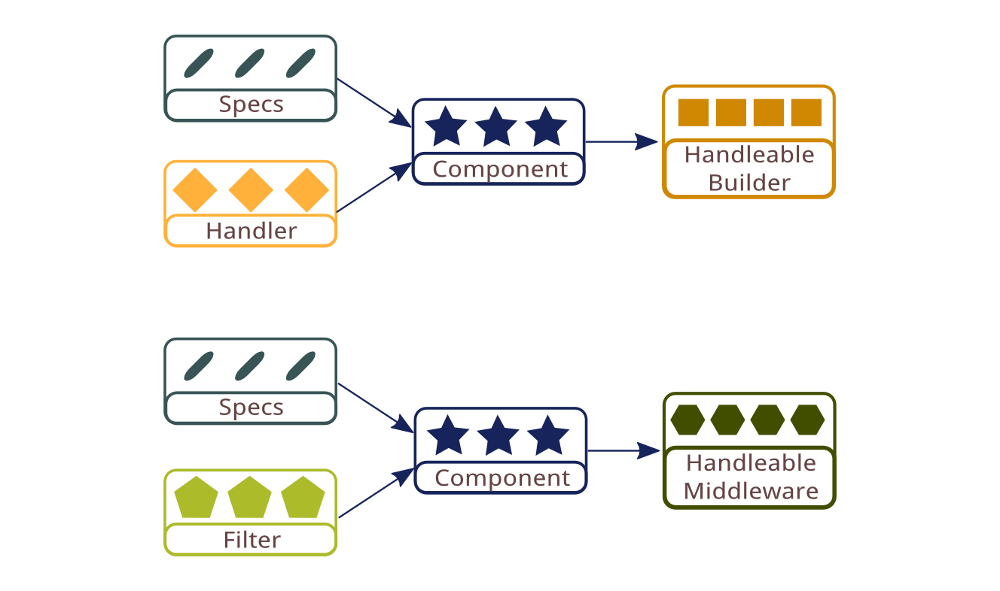

# Component System

The previous sections introduced the foundation architecture for Quiver. On top of that there is a final component system built to link components of different types together. The quiver component system is designed to allow components to have complex dependencies among each others. For example, a handler component may have dependency on a filter component, which in turn may have dependencies with other handlers or filters.

The steps of defining and using quiver components is separated into several phases:

  - Component definition
  - Component loading
  - Component conversion
  - Component registry

## Component Definition

The quiver component system has a JSON-like DSL, which define components in simple key-value pairs. The main difference of the component DSL and JSON is that the component DSL usually has one field with function value. That is used to reference the actual function body of a component, which may be defined separately from the component definition.

A component manifest has another two essential fields: name and type. The name field serves as a unique identifier for the component so that it can be referenced from other components by name. Since the component name is defined as a string, space is often used for easier typing and reading. The type field tells the component system what kind of component it is, so that the system knows how to manage it.

Quiver components are usually defined in separate source files. Each of the source files will make use of Node's module system to export the components inside a `quiverComponents` array.

Following is an example of a simple handler component definition:

```javascript
  exports.quiverComponents = [
    {
      name: 'my handler',
      type: 'stream handler',
      handlerBuilder: function(config, callback) { ... }
    }
  ]
```

## Component Loading

There are several library functions available to import quiver components from multiple source files. A component loader provide custom ways to search for the components and then combine them into a single array containing all components.

For example, the function below synchronously load components from all source files under a directory:

```javascript
  var components = loadComponentsFromDirectorySync('/path/to/dir')
```

## Component Conversion



Quiver component system manages different types of components by converting all of them into two universal component supertypes: handleable builder and handleable middleware. All handler and their builder types, including stream handler and http handler, are converted into handleable builders. Similarly all filter and middleware types are converted into handleable middleware.

The conversion to the handleable supertype allows the quiver component system to not have to deal with each of the specific types separately. It also makes it easy to introduce new handler types in future, since all handler types can be wrapped into the handleable supertype.

The handleable type system also allow implicit type checking against component composition of different handler types. For example if a http filter is requested to be applied to a stream handler, the component system would not type check the filter application at conversion time. Instead the http filter would be converted into a handleable middleware which expects a handleable builder. It then receives the converted handleable builder during component instantiation time, and attempt to convert the result handleable into a http handler. It is by this time that the handleable middleware detects that the result handleable do not have a `toHttpHandler()` method, and therefore produce a runtime error.

## Component registry

After converting components into handleable builders and handleable middlewares, the component system stores the result in a registry made of plain object. All handleable builders are stored as a table inside the registry's `quiverHandleableBuilders` field, with the component name as the key. Similarly handleable middlewares are stored inside the registry's `quiverHandleableMiddlewares` field.

As explained in the next section, the registry is later returned and used as a config object for component instantiation. Because of this it is also refered as `componentConfig` or simply `config`. A common step after getting the component registry is to merge it with the user config to get a single config object:

```javascript
  installComponents(components, function(err, componentConfig) {
    if(err) return ...

    var config = mergeObject([componentConfg, userConfig])
    ...
  })
```

## Component Dependencies

Quiver manages component dependencies by name instead of having hard function reference. Because of that the component system is able to convert individual components without having full knowledge of the complete list of components. For example if a handler component depends on a filter component, the system would simply convert it into a managed handleable builder, which later retrieve the converted handleable middleware component by name when it receives a config. it then applies the middleware with the original handler builder to get the desired final result.

```javascript
  {
    name: 'my handler',
    type: 'stream handler',
    middlewares: [
      'my filter'
    ],
    handlerBuilder: myHandlerBuilder
  }
```

To demonstrate the concept, the component definition above would be converted into a managed handleable builder that is equivalent to the manual composition below:

```javascript
  var myHandlerBuilder = function(config, callback) { ... }

  var myHandleableBuilder = streamHandlerBuilderToHandleableBuilder(
    myHandlerBuilder)

  var myManagedHandleableBuilder = function(config, callback) {
    var handleableMiddleware = config.quiverMiddlewares['my filter']

    handleableMiddleware(config, myHandleableBuilder, callback)
  }

  var componentConfig = {
    quiverHandleableBuilders: {
      'my handler': myManagedHandleableBuilder
    }
  }
```

It is also worth noting that the component system is similar to a macro system that expands component definition with many boilerplate code. However Quiver is able implement the same effect using functional composition without relying on any macro facilities (which is not supported in Javascript).

## Next: [Summary](11-summary.md)